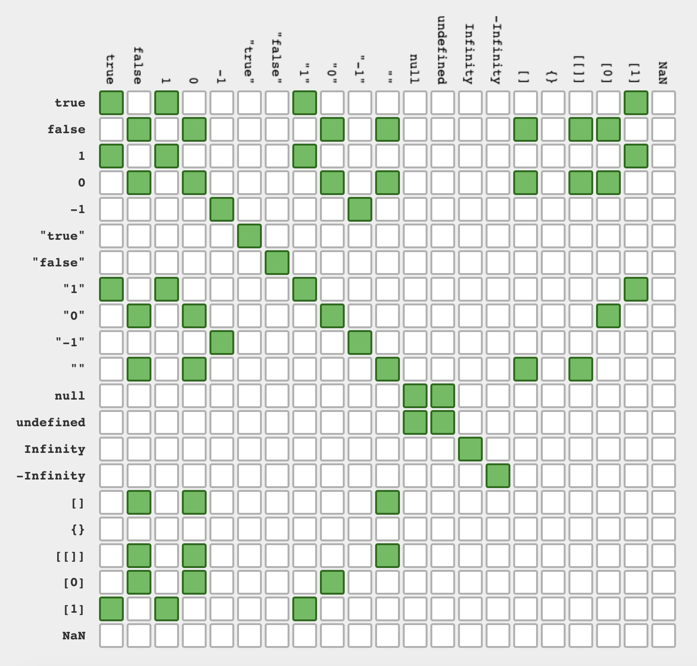

## Equality

One thing to be careful about in JavaScript is the difference between `==` and `===`. As JavaScript tries to
be resilient against programming errors `==` tries to do type coercion between two variables e.g. converts a
string to a number so that you can compare with a number as shown below:

```js
console.log(5 == "5"); // true   , TS Error
console.log(5 === "5"); // false , TS Error
```

However, the choices JavaScript makes are not always ideal. For example, in the below example the first statement is false
because `""` and `"0"` are both strings and are clearly not equal. However, in the second case both `0` and the
empty string (`""`) are falsy (i.e. behave like `false`) and are therefore equal with respect to `==`. Both statements
are false when you use `===`.

```js
console.log("" == "0"); // false
console.log(0 == ""); // true

console.log("" === "0"); // false
console.log(0 === ""); // false
```

To make the understanding clear, here's a table that summarizes this issue from [dorey's awesome website](https://dorey.github.io/JavaScript-Equality-Table/): 

Loose equality(`==`):



Strict equality(`===`):


As you can notice, strict equality clears any doubts. If you don't have a particular reason, always go for `===`. So ProTip: Always use `===` and `!==` except for null checks, which we cover later.

> Note that `string == number` and `string === number` are both compile time errors in TypeScript, so you don't normally need to worry about this.

Similar to `==` vs. `===`, there is `!=` vs. `!==`

## Structural Equality 
If you want to compare two objects for structural equality `==`/`===` are ***not*** sufficient. e.g. 

```js
console.log({a:123} == {a:123}); // False
console.log({a:123} === {a:123}); // False
```
To do such checks use the [deep-equal](https://www.npmjs.com/package/deep-equal) npm package e.g. 

```js
import * as deepEqual from "deep-equal";

console.log(deepEqual({a:123},{a:123})); // True
```

However, quite commonly you don't need deep checks and all you really need is to check by some `id` e.g. 

```ts
type IdDisplay = {
  id: string,
  display: string
}
const list: IdDisplay[] = [
  {
    id: 'foo',
    display: 'Foo Select'
  },
  {
    id: 'bar',
    display: 'Bar Select'
  },
]

const fooIndex = list.map(i => i.id).indexOf('foo');
console.log(fooIndex); // 0
```
